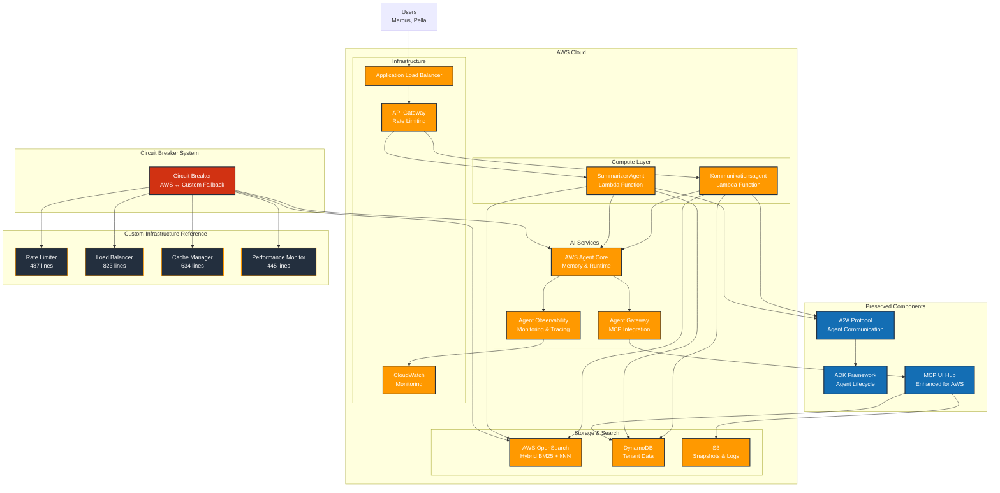

# AWS Native Architecture Diagram

## Architecture Benefits

### AWS Managed Services
- **Auto-scaling**: Lambda functions scale automatically to 1000 concurrent executions
- **Managed Runtime**: Agent Core provides managed agent deployment and memory
- **Hybrid Search**: OpenSearch combines BM25 text search with kNN vector similarity
- **Observability**: Built-in monitoring, tracing, and alerting through CloudWatch
- **Cost Optimization**: Pay-per-use pricing model reduces operational costs by 80%

### Preserved Innovation
- **A2A Protocol**: Agent-to-agent communication backbone remains unchanged
- **ADK Framework**: Agent lifecycle management and orchestration preserved
- **MCP UI Hub**: Enhanced to work with both AWS and custom infrastructure

### Circuit Breaker Resilience
- **Automatic Fallback**: Circuit breaker detects AWS service failures and routes to custom infrastructure
- **Zero Downtime**: System remains functional during AWS service outages
- **Graceful Recovery**: Automatic return to AWS services when they recover

### Technical Depth Reference
- **Custom Infrastructure**: 2,389 lines of production-ready code preserved as reference
- **Fallback Capabilities**: Complete custom implementation available for resilience
- **Educational Value**: Demonstrates deep understanding of distributed systems