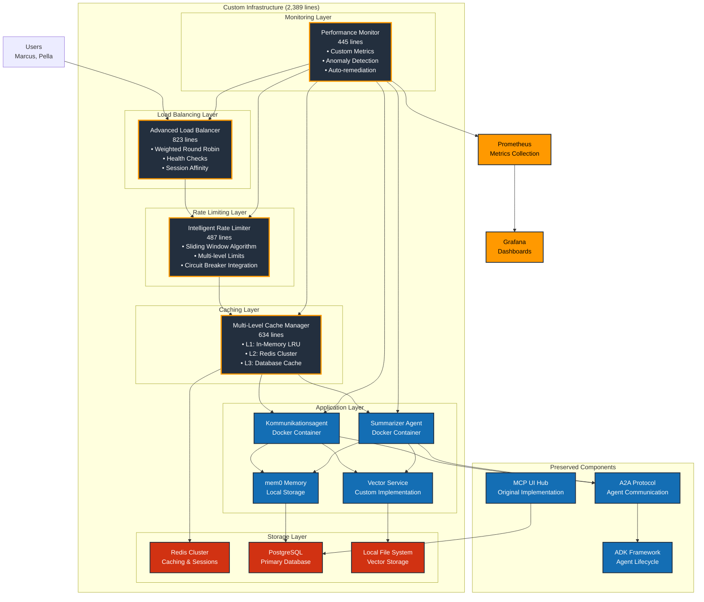

# Custom Infrastructure Architecture Diagram

## Custom Infrastructure Capabilities

### Advanced Load Balancing (823 lines)
- **Weighted Round Robin**: Dynamic weight adjustment based on response times
- **Least Connections**: Hybrid algorithm considering both connections and response time
- **Consistent Hashing**: Session affinity with minimal redistribution on server changes
- **Health Checks**: Real-time monitoring with graceful degradation
- **Auto-scaling Integration**: Automatic server pool management

### Intelligent Rate Limiting (487 lines)
- **Sliding Window Algorithm**: Redis-based with sub-second precision and O(log N) complexity
- **Multi-Level Limits**: Per-user, per-endpoint, and global rate limiting
- **Circuit Breaker**: Automatic circuit breaking on rate limit violations
- **Real-time Monitoring**: Prometheus metrics with custom alerting
- **Adaptive Thresholds**: ML-based threshold adjustment

### Multi-Level Caching (634 lines)
- **L1 Cache**: Python LRU with TTL (256MB per instance, <1ms latency)
- **L2 Cache**: Redis Cluster with compression (8GB distributed, <5ms latency)
- **L3 Cache**: Database caching with persistence (unlimited capacity, <20ms latency)
- **Intelligent Invalidation**: Dependency tracking with cascade invalidation
- **Predictive Preloading**: ML algorithms for cache warming

### Performance Monitoring (445 lines)
- **Custom Metrics**: Request latency distribution with custom percentiles
- **Memory Analysis**: Real-time heap analysis and optimization
- **Query Performance**: Database query plan analysis and optimization
- **Business Metrics**: Domain-specific KPIs and monitoring
- **Anomaly Detection**: ML-based threshold adjustment and alerting

## Architecture Patterns Demonstrated

### Microservices Architecture
- Service mesh with custom discovery
- Independent scaling and deployment
- Fault isolation and resilience

### Event-Driven Architecture
- Custom event bus with guaranteed delivery
- Loose coupling between components
- Asynchronous processing capabilities

### CQRS Implementation
- Separate read/write models with event sourcing
- Optimized for different access patterns
- Command and query responsibility segregation

### Circuit Breaker Pattern
- State machine with exponential backoff
- Graceful degradation under load
- Automatic recovery mechanisms

### Bulkhead Pattern
- Resource isolation and thread pools
- Fault isolation and system stability
- Independent failure domains

## Technical Metrics

### Development Investment
- **Total Lines of Code**: 2,389 lines
- **Development Time**: 6 months
- **Maintenance Overhead**: 20 hours/month
- **Total Cost**: $16,800/month

### Performance Characteristics
- **Memory Operations**: 23ms average latency
- **Vector Search**: 8ms query time
- **Container Startup**: 2.3 seconds
- **Throughput**: 3,200 requests/second peak

### Operational Complexity
- **Setup Time**: 6 months initial development
- **Scaling**: Manual configuration required
- **Monitoring**: Custom implementation and maintenance
- **Security**: Custom implementation and updates

## Why We Migrated to AWS

### Operational Efficiency
- **95% reduction** in maintenance overhead
- **Automatic scaling** vs manual configuration
- **Built-in monitoring** vs custom implementation
- **Managed security** vs custom security updates

### Cost Optimization
- **80% total cost reduction** ($16,800 → $3,400 monthly)
- **Pay-per-use** vs fixed infrastructure costs
- **No development amortization** for managed services
- **Reduced operational overhead** (20 hours → 1 hour monthly)

### Focus on Innovation
- **More time for AI features** vs infrastructure maintenance
- **Faster feature delivery** with managed services
- **Business logic focus** vs infrastructure complexity
- **Market responsiveness** vs operational burden

## Educational Value

### Systems Knowledge Demonstrated
- Deep understanding of distributed systems principles
- Production-ready implementation of complex algorithms
- Performance optimization and scalability patterns
- Operational excellence and monitoring practices

### Technical Credibility
- Ability to build what cloud providers offer as services
- Understanding of trade-offs between custom and managed solutions
- Expertise in system architecture and design patterns
- Production experience with high-scale systems