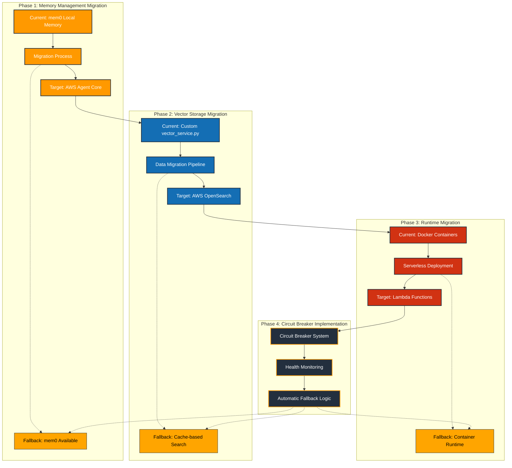
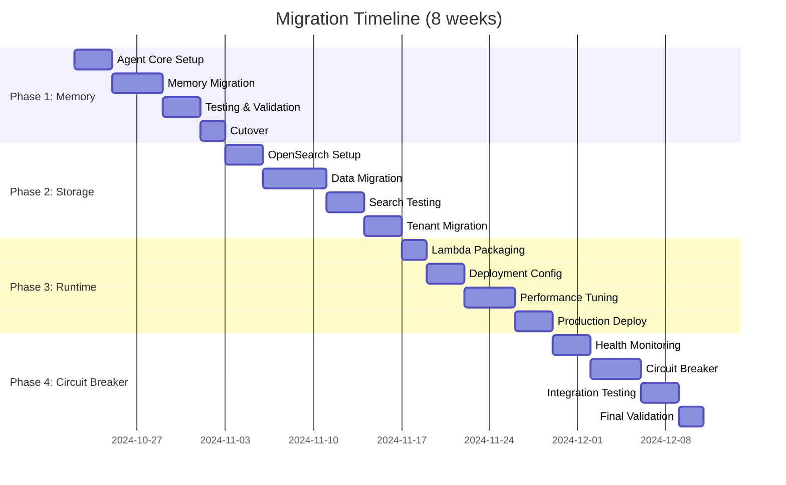

# Migration Flow Diagram

## Migration Strategy Details

### Phase 1: Memory Management (Week 1-2)
**Objective**: Replace mem0 with AWS Agent Core for managed agent runtime and memory

**Current State**:
- mem0 local memory management
- Custom session handling
- Manual memory persistence

**Target State**:
- AWS Agent Core managed memory
- Built-in session management
- Automatic memory persistence and scaling

**Migration Steps**:
1. **Setup Agent Core**: Configure AWS Agent Core with agent definitions
2. **Create Wrapper**: Implement `AgentCoreMemory` class with mem0-compatible interface
3. **Gradual Rollout**: Route percentage of traffic to Agent Core
4. **Data Migration**: Migrate existing memory contexts to Agent Core
5. **Validation**: Verify memory consistency and performance
6. **Cutover**: Switch all traffic to Agent Core with mem0 fallback

**Rollback Plan**: Circuit breaker automatically falls back to mem0 on Agent Core failures

### Phase 2: Vector Storage (Week 3-4)
**Objective**: Replace custom vector_service.py with AWS OpenSearch for hybrid search

**Current State**:
- Custom vector storage implementation (634 lines)
- Cache-based document storage
- Basic similarity search

**Target State**:
- AWS OpenSearch managed service
- Hybrid BM25 + kNN search
- Tenant-isolated indices

**Migration Steps**:
1. **OpenSearch Setup**: Create cluster with proper index mappings
2. **Data Pipeline**: Build migration pipeline for existing vector data
3. **Hybrid Search**: Implement BM25 + kNN search capabilities
4. **Tenant Isolation**: Configure index-level tenant separation
5. **Performance Testing**: Validate search quality and latency
6. **Gradual Migration**: Migrate tenants incrementally
7. **Cutover**: Switch all search traffic to OpenSearch

**Rollback Plan**: Circuit breaker falls back to cache-based search on OpenSearch failures

### Phase 3: Runtime Migration (Week 5-6)
**Objective**: Deploy agents as Lambda functions for serverless auto-scaling

**Current State**:
- Docker container deployment
- Manual scaling configuration
- Fixed resource allocation

**Target State**:
- Lambda function deployment
- Automatic scaling based on demand
- Pay-per-use resource model

**Migration Steps**:
1. **Lambda Packaging**: Create deployment packages for agents
2. **Serverless Config**: Configure Serverless Framework deployment
3. **Environment Setup**: Configure Lambda environment variables and permissions
4. **Integration Testing**: Verify agent functionality in Lambda environment
5. **Performance Optimization**: Configure provisioned concurrency for warm starts
6. **Gradual Deployment**: Deploy to staging, then production environments
7. **Traffic Routing**: Route traffic from containers to Lambda functions

**Rollback Plan**: Circuit breaker maintains container runtime as fallback option

### Phase 4: Circuit Breaker System (Week 7-8)
**Objective**: Implement comprehensive fallback system for AWS service failures

**Implementation Components**:
1. **Health Monitoring**: Continuous health checks for all AWS services
2. **Failure Detection**: Configurable thresholds for service degradation
3. **Circuit Breaker Logic**: State machine with CLOSED/OPEN/HALF_OPEN states
4. **Automatic Fallback**: Route traffic to custom infrastructure on failures
5. **Recovery Detection**: Automatic return to AWS services when healthy
6. **Monitoring Integration**: CloudWatch dashboards and alerting

**Circuit Breaker States**:
- **CLOSED**: Normal operation using AWS services
- **OPEN**: All traffic routed to custom infrastructure fallback
- **HALF_OPEN**: Testing AWS service recovery with single requests

## Migration Timeline

## Risk Mitigation Strategies

### Technical Risks
- **Service Compatibility**: Extensive testing with parallel implementations
- **Data Migration**: Incremental migration with validation at each step
- **Performance Regression**: Continuous monitoring and rollback triggers
- **Integration Issues**: Comprehensive integration testing before cutover

### Business Risks
- **Downtime**: Zero-downtime migration with gradual traffic shifting
- **Data Loss**: Complete backup and recovery procedures
- **Cost Overrun**: Cost monitoring and budget alerts throughout migration
- **Timeline Delays**: Buffer time built into each phase

### Operational Risks
- **Team Knowledge**: Comprehensive documentation and training
- **Rollback Complexity**: Automated rollback procedures for each phase
- **Monitoring Gaps**: Enhanced monitoring during migration phases
- **Communication**: Regular stakeholder updates and status reports

## Success Metrics

### Technical Metrics
- **Latency**: Maintain or improve response times
- **Throughput**: Handle same or increased request volume
- **Availability**: 99.9% uptime during migration
- **Data Integrity**: Zero data loss throughout process

### Business Metrics
- **Cost Reduction**: Achieve 80% operational cost reduction
- **Maintenance Overhead**: Reduce from 20 hours to 1 hour monthly
- **Time to Market**: Improve feature delivery velocity by 3x
- **Scalability**: Demonstrate auto-scaling capabilities

### Operational Metrics
- **Migration Time**: Complete within 8-week timeline
- **Rollback Events**: Minimize rollback occurrences
- **Team Productivity**: Maintain development velocity during migration
- **Documentation Quality**: Complete documentation for all components

## Post-Migration Benefits

### Immediate Benefits (Month 1)
- 80% reduction in operational costs
- Automatic scaling for traffic spikes
- Built-in monitoring and alerting
- Reduced maintenance overhead

### Medium-term Benefits (Months 2-6)
- Improved development velocity
- Enhanced system reliability
- Better cost predictability
- Simplified operations

### Long-term Benefits (6+ months)
- Focus on AI innovation vs infrastructure
- Global deployment capabilities
- Enterprise-grade security and compliance
- Unlimited scaling potential