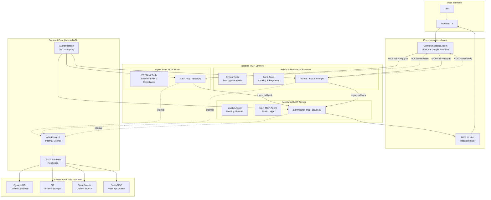
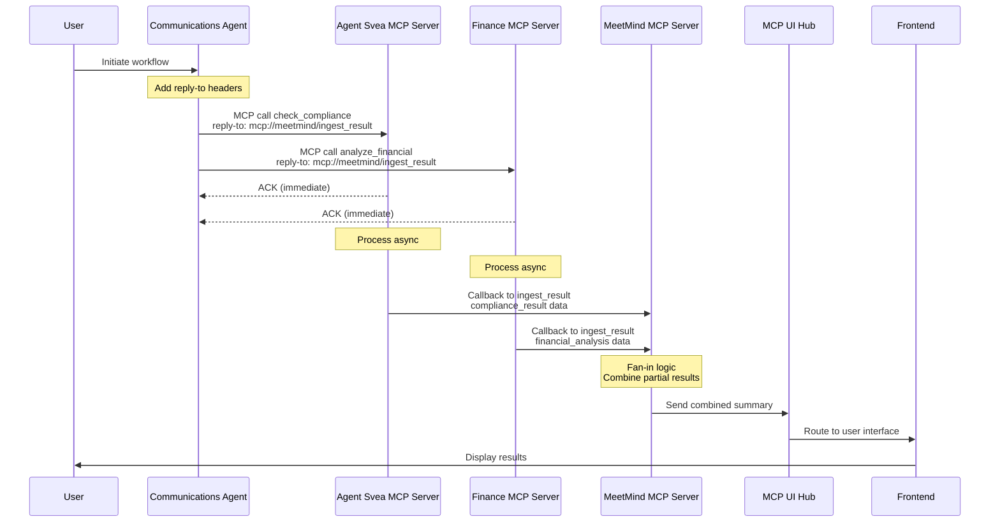
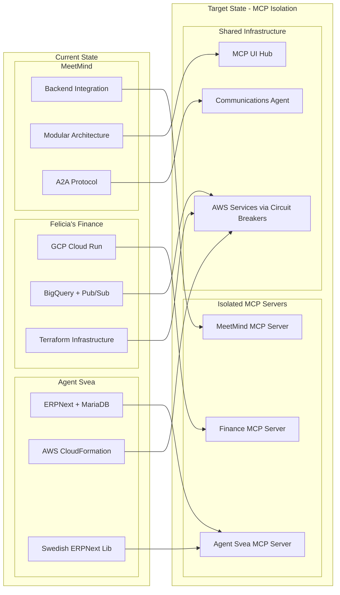

# Design Document

## Overview

This design focuses on three core areas: **Agent Isolation**, **A2A Protocol Implementation**, and **AWS-Native Architecture**. Each agent runs as an isolated MCP server with zero backend dependencies, communicating via MCP protocol with reply-to semantics, deployed on AWS infrastructure.

## Core Design Principles

### 1. Complete Agent Isolation
- Each agent runs as standalone MCP server
- Zero `backend.*` imports in agent code
- Independent deployment and scaling

### 2. MCP Protocol Communication
- All inter-agent communication via MCP
- Reply-to semantics for async callbacks
- Signed headers for security

### 3. AWS-Native Implementation
- Amazon Bedrock for LLM hosting
- AWS Lambda for serverless execution
- DynamoDB for multi-tenant storage
- Circuit breakers for resilience

## Architecture

### High-Level Architecture - MCP One-Way Communication



### MCP Communication Sequence



### Migration Architecture



## Components and Interfaces

### 1. MCP Server Integration Layer

Each agent system operates as a standalone MCP server with standardized interfaces:

#### MCP Server Interface
```python
class AgentMCPServer:
    def __init__(self, agent_type: str, server_config: Dict[str, Any])
    async def initialize(self) -> bool
    async def handle_mcp_call(self, tool_name: str, arguments: Dict, headers: MCPHeaders) -> MCPResponse
    async def send_async_callback(self, reply_to: str, result: Dict, headers: MCPHeaders) -> bool
    async def get_available_tools(self) -> List[MCPTool]
    async def get_health_status(self) -> HealthStatus

class MCPHeaders:
    tenant_id: str
    trace_id: str
    conversation_id: str
    reply_to: str
    auth_sig: str
    caller: str
```

#### Agent-Specific Implementations

**Agent Svea Wrapper**
- Wraps existing ERPNext functionality
- Provides Swedish ERP and compliance capabilities
- Integrates with BAS validation and Skatteverket APIs
- Maintains existing Swedish ERPNext Library

**Felicia's Finance Wrapper**
- Migrates from GCP to AWS infrastructure
- Provides crypto trading and banking capabilities
- Integrates Bank of Anthos and crypto MCP servers
- Maintains existing financial analysis features

**MeetMind Wrapper**
- Leverages existing backend integration
- Provides meeting intelligence and summarization
- Maintains modular architecture with A2A protocol
- Integrates with LiveKit for real-time communication

### 2. Infrastructure Unification Layer

#### Service Facade Enhancement
Extend the existing `ServiceFacade` to support agent-specific requirements:

```python
class UnifiedServiceFacade(ServiceFacade):
    async def get_agent_database_service(self, agent_type: str) -> AgentDatabaseService
    async def get_agent_storage_service(self, agent_type: str) -> AgentStorageService
    async def get_agent_compute_service(self, agent_type: str) -> AgentComputeService
    async def migrate_gcp_resources(self, migration_config: GCPMigrationConfig) -> MigrationResult
```

#### Database Unification
```python
class UnifiedDatabaseService:
    # Agent Svea - ERPNext data
    async def store_erp_document(self, doc: ERPDocument, tenant_id: str) -> str
    async def query_bas_accounts(self, query: BASQuery, tenant_id: str) -> List[BASAccount]
    
    # Felicia's Finance - Trading data
    async def store_trading_data(self, trade: TradingRecord, tenant_id: str) -> str
    async def query_portfolio_data(self, query: PortfolioQuery, tenant_id: str) -> PortfolioData
    
    # MeetMind - Meeting data
    async def store_meeting_transcript(self, transcript: MeetingTranscript, tenant_id: str) -> str
    async def query_meeting_insights(self, query: InsightQuery, tenant_id: str) -> List[Insight]
```

### 3. MCP Protocol Implementation

#### MCP Tool Definitions
```python
class MCPTool:
    name: str
    description: str
    input_schema: Dict
    output_schema: Dict

# Agent Svea MCP Tools
AGENT_SVEA_TOOLS = [
    MCPTool("check_compliance", "Validate Swedish regulatory compliance", {...}),
    MCPTool("validate_bas_account", "Validate BAS account structure", {...}),
    MCPTool("submit_skatteverket", "Submit to Swedish tax authority", {...}),
    MCPTool("sync_erp_document", "Synchronize ERP document", {...})
]

# Felicia's Finance MCP Tools  
FINANCE_TOOLS = [
    MCPTool("analyze_crypto_trade", "Analyze cryptocurrency trading signal", {...}),
    MCPTool("get_portfolio_analysis", "Generate portfolio analysis", {...}),
    MCPTool("process_banking_transaction", "Process banking transaction", {...}),
    MCPTool("calculate_financial_risk", "Calculate financial risk metrics", {...})
]

# MeetMind MCP Tools
MEETMIND_TOOLS = [
    MCPTool("ingest_result", "Receive partial results from other agents", {...}),
    MCPTool("generate_meeting_summary", "Generate meeting summary", {...}),
    MCPTool("extract_financial_topics", "Extract financial topics from transcript", {...}),
    MCPTool("create_action_items", "Create action items from meeting", {...})
]
```

#### Cross-Agent Workflow via MCP Reply-To
```python
class MCPWorkflowOrchestrator:
    async def execute_compliance_workflow(self, meeting_context: Dict, headers: MCPHeaders) -> None:
        """
        1. Communications Agent calls Agent Svea and Felicia's Finance with reply-to=meetmind
        2. Each agent ACKs immediately, processes async, sends results to MeetMind
        3. MeetMind collects partial results (fan-in), combines with meeting context
        4. MeetMind sends final summary to MCP UI Hub
        """
        # Communications Agent orchestrates via MCP calls
        await self.call_agent_svea("check_compliance", meeting_context, headers)
        await self.call_finance_agent("analyze_financial_implications", meeting_context, headers)
        
        # Results flow to MeetMind via reply-to callbacks
        # MeetMind handles fan-in logic and final summary
        
    async def call_agent_svea(self, tool: str, context: Dict, headers: MCPHeaders) -> MCPResponse:
        # MCP call with reply-to header pointing to MeetMind
        headers.reply_to = "mcp://meetmind/ingest_result"
        return await self.mcp_client.call_tool("agent_svea", tool, context, headers)
```

### 4. Migration Strategy

#### GCP to AWS Migration Components

**Data Migration Service**
```python
class GCPToAWSMigrator:
    async def migrate_bigquery_to_opensearch(self, dataset_config: BigQueryConfig) -> MigrationResult
    async def migrate_pubsub_to_eventbridge(self, topic_config: PubSubConfig) -> MigrationResult
    async def migrate_cloud_run_to_lambda(self, service_config: CloudRunConfig) -> MigrationResult
    async def migrate_gcs_to_s3(self, bucket_config: GCSConfig) -> MigrationResult
```

**Infrastructure as Code Migration**
- Convert Terraform configurations to AWS CDK
- Maintain infrastructure versioning and rollback capabilities
- Implement blue-green deployment for migration

## Data Models

### Unified Agent Registry
```python
@dataclass
class AgentRegistration:
    agent_id: str
    agent_type: AgentType  # AGENT_SVEA, FELICIAS_FINANCE, MEETMIND
    capabilities: List[AgentCapability]
    endpoint: str
    health_status: HealthStatus
    tenant_id: str
    metadata: Dict[str, Any]
    registered_at: datetime
    last_heartbeat: datetime
```

### Cross-Agent Data Models
```python
@dataclass
class UnifiedDocument:
    document_id: str
    document_type: DocumentType
    source_agent: AgentType
    tenant_id: str
    content: Dict[str, Any]
    metadata: DocumentMetadata
    created_at: datetime
    updated_at: datetime

@dataclass
class CrossAgentWorkflowState:
    workflow_id: str
    workflow_type: WorkflowType
    participating_agents: List[str]
    current_step: int
    total_steps: int
    state_data: Dict[str, Any]
    status: WorkflowStatus
    created_at: datetime
    updated_at: datetime
```

### Agent-Specific Data Models

**Agent Svea Models**
```python
@dataclass
class BASAccount:
    account_number: str
    account_name: str
    account_type: BASAccountType
    parent_account: Optional[str]
    tenant_id: str

@dataclass
class SwedishComplianceRecord:
    record_id: str
    compliance_type: ComplianceType
    status: ComplianceStatus
    validation_result: Dict[str, Any]
    tenant_id: str
```

**Felicia's Finance Models**
```python
@dataclass
class TradingRecord:
    trade_id: str
    symbol: str
    trade_type: TradeType
    quantity: Decimal
    price: Decimal
    timestamp: datetime
    tenant_id: str

@dataclass
class PortfolioSnapshot:
    portfolio_id: str
    assets: List[AssetHolding]
    total_value: Decimal
    snapshot_time: datetime
    tenant_id: str
```

**MeetMind Models**
```python
@dataclass
class MeetingTranscript:
    transcript_id: str
    meeting_id: str
    content: str
    participants: List[str]
    duration: int
    tenant_id: str

@dataclass
class MeetingInsight:
    insight_id: str
    meeting_id: str
    insight_type: InsightType
    content: str
    confidence_score: float
    tenant_id: str
```

## Error Handling

### Unified Error Handling Strategy

#### Error Categories
```python
class UnifiedErrorType(Enum):
    AGENT_COMMUNICATION_ERROR = "agent_communication_error"
    INFRASTRUCTURE_FAILURE = "infrastructure_failure"
    DATA_MIGRATION_ERROR = "data_migration_error"
    COMPLIANCE_VALIDATION_ERROR = "compliance_validation_error"
    CROSS_AGENT_WORKFLOW_ERROR = "cross_agent_workflow_error"
```

#### Error Recovery Patterns
```python
class UnifiedErrorHandler:
    async def handle_agent_failure(self, agent_id: str, error: Exception) -> RecoveryAction
    async def handle_infrastructure_failure(self, service: str, error: Exception) -> FallbackAction
    async def handle_migration_error(self, migration_step: str, error: Exception) -> RollbackAction
    async def handle_workflow_error(self, workflow_id: str, error: Exception) -> CompensationAction
```

### Circuit Breaker Enhancements
Extend existing circuit breakers to handle agent-specific failures:

```python
class AgentCircuitBreaker(CircuitBreaker):
    def __init__(self, agent_type: AgentType, config: CircuitBreakerConfig)
    async def execute_agent_operation(self, operation: Callable, fallback: Optional[Callable] = None)
    async def get_agent_health_metrics(self) -> AgentHealthMetrics
```

## Testing Strategy

### Integration Testing Framework

#### Cross-Agent Integration Tests
```python
class CrossAgentIntegrationTest:
    async def test_agent_svea_to_felicias_finance_workflow(self)
    async def test_meetmind_to_agent_svea_compliance_check(self)
    async def test_three_agent_financial_reporting_workflow(self)
```

#### Migration Testing
```python
class MigrationTestSuite:
    async def test_gcp_to_aws_data_migration(self)
    async def test_terraform_to_cdk_conversion(self)
    async def test_service_continuity_during_migration(self)
```

#### Resilience Testing
```python
class ResilienceTestSuite:
    async def test_agent_failure_recovery(self)
    async def test_aws_service_failover_to_local(self)
    async def test_cross_agent_workflow_compensation(self)
```

### Performance Testing

#### Load Testing Scenarios
- Concurrent multi-agent workflows
- High-volume A2A message processing
- Database performance under unified load
- Circuit breaker behavior under stress

#### Scalability Testing
- Agent system auto-scaling
- AWS service scaling behavior
- Cross-agent communication performance
- Database query optimization

## Implementation Phases

### Phase 1: Infrastructure Foundation (Weeks 1-2)
1. Extend Service Facade for agent-specific services
2. Enhance A2A protocol with agent message types
3. Create unified database schemas
4. Implement agent registry service

### Phase 2: Agent Integration (Weeks 3-4)
1. Implement Agent Svea wrapper and integration
2. Implement MeetMind wrapper (leverage existing integration)
3. Create cross-agent workflow orchestration
4. Implement unified error handling

### Phase 3: Felicia's Finance Migration (Weeks 5-6)
1. Implement GCP to AWS migration tools
2. Migrate data from BigQuery to OpenSearch/DynamoDB
3. Convert Terraform to AWS CDK
4. Implement Felicia's Finance wrapper

### Phase 4: Testing and Optimization (Weeks 7-8)
1. Comprehensive integration testing
2. Performance optimization
3. Security validation
4. Documentation and deployment guides

## Security Considerations

### Authentication and Authorization
- Leverage existing JWT-based authentication
- Implement agent-specific RBAC policies
- Secure A2A protocol communication with encryption
- Audit logging for all cross-agent interactions

### Data Protection
- Tenant isolation across all agent systems
- Encryption at rest and in transit
- Compliance with GDPR and Swedish data protection laws
- Secure migration of sensitive financial data

### Network Security
- VPC isolation for AWS resources
- Secure API gateways for agent communication
- Network-level access controls
- DDoS protection and rate limiting

## Monitoring and Observability

### Unified Monitoring Dashboard
- Agent health status across all systems
- A2A protocol message flow visualization
- Cross-agent workflow execution tracking
- Infrastructure resource utilization

### Alerting Strategy
- Agent failure notifications
- Circuit breaker state changes
- Migration progress and issues
- Performance threshold violations

### Logging and Tracing
- Distributed tracing across agent systems
- Correlation IDs for cross-agent workflows
- Structured logging with agent context
- Audit trails for compliance requirements

## Cost Optimization

### Resource Consolidation
- Shared AWS services across all agent systems
- Elimination of duplicate infrastructure
- Auto-scaling based on combined load
- Reserved instance optimization

### Migration Cost Management
- Phased migration to minimize disruption
- Cost comparison between GCP and AWS
- Resource right-sizing during migration
- Monitoring of cost allocation per agent system

This design provides a comprehensive foundation for unifying the three agent systems while maintaining their specialized capabilities and ensuring robust, scalable, and cost-effective operations.