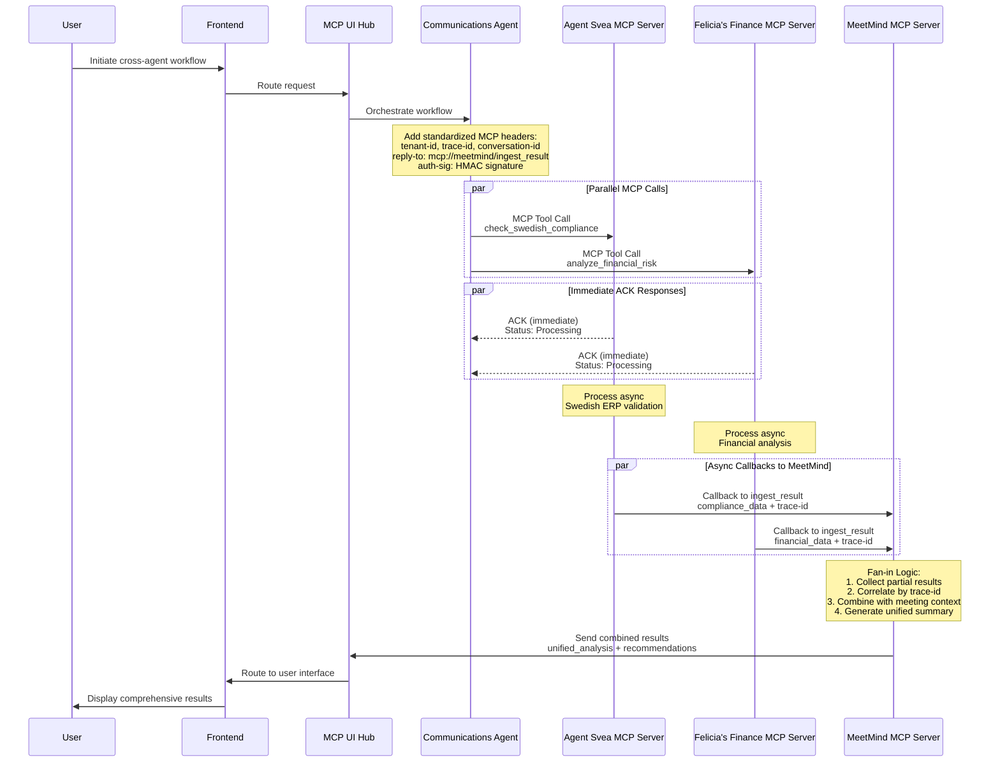

# Design Document

## Overview

This design establishes architectural consistency across all three HappyOS agent systems (Agent Svea, Felicia's Finance, and MeetMind) by refactoring agents to use the existing, complete HappyOS SDK exclusively. 

**Based on comprehensive analysis (`.analysis/00_inventory.md`):**
- ✅ **HappyOS SDK is fully implemented** with MCP client, A2A client, service facades, circuit breakers, error handling, and logging
- ✅ **Backend Core A2A infrastructure is complete** and should be preserved for internal backend communication
- ❌ **All agents currently violate isolation** with backend.* imports that must be replaced with HappyOS SDK imports
- 🎯 **Primary work is refactoring, not new development**

The design ensures complete server isolation while leveraging existing standardized infrastructure access patterns.

## Architecture

### Unified HappyOS Agent Architecture

```mermaid
graph TB
    subgraph "User Interface Layer"
        USER[User]
        FRONTEND[React Frontend<br/>Unified UI]
    end
    
    subgraph "Communications & Orchestration Layer"
        COMM[Communications Agent<br/>LiveKit + Google Realtime<br/>MCP Workflow Orchestrator]
        MCP_UI[MCP UI Hub<br/>Results Router & Fan-out<br/>Multi-tenant UI Management]
    end
    
    subgraph "Isolated MCP Servers - Global A2A Protocol"
        subgraph "Agent Svea MCP Server"
            AS_TOOLS[ERPNext Tools<br/>• Swedish ERP Operations<br/>• BAS Compliance<br/>• Skatteverket Integration]
            AS_SERVER[svea_mcp_server.py<br/>Zero backend.* imports]
        end
        
        subgraph "Felicia's Finance MCP Server"
            FF_TOOLS[Financial Tools<br/>• Crypto Trading<br/>• Banking Operations<br/>• Portfolio Analysis]
            FF_SERVER[finance_mcp_server.py<br/>Zero backend.* imports]
        end
        
        subgraph "MeetMind MCP Server"
            MM_TOOLS[Meeting Tools<br/>• Real-time Transcription<br/>• AI Summarization<br/>• Action Extraction]
            MM_SERVER[meetmind_mcp_server.py<br/>Fan-in Logic + Zero backend.* imports]
        end
    end
    
    subgraph "HappyOS SDK Layer - Protocol Translation"
        SDK[HappyOS SDK<br/>MCP ↔ A2A Translation Layer]
        MCP_CLIENT[MCP Client<br/>Agent-to-Agent Communication]
        A2A_CLIENT[A2A Client<br/>Backend Service Communication]
        FACADES[Service Facades<br/>Database, Storage, Compute]
        CB_SDK[Circuit Breakers<br/>AWS ↔ Local Failover]
    end
    
    subgraph "Backend Core Services (Internal A2A Only)"
        AUTH[Authentication Service<br/>JWT + Signed Headers]
        TENANT[Tenant Isolation<br/>Multi-tenant Security]
        DB_SERVICE[Database Service<br/>Multi-tenant Data Access]
        STORAGE_SERVICE[Storage Service<br/>S3 + Local Fallback]
        COMPUTE_SERVICE[Compute Service<br/>Lambda + Local Jobs]
        AUDIT[Audit Logging<br/>Compliance & Monitoring]
    end
    
    subgraph "Unified AWS Infrastructure"
        BEDROCK[Amazon Bedrock<br/>LLM Hosting]
        LAMBDA[AWS Lambda<br/>Serverless Compute]
        DDB[DynamoDB<br/>Multi-tenant Database]
        S3[S3<br/>Unified Storage]
        OS[OpenSearch<br/>Search & Analytics]
        SQS[SQS/EventBridge<br/>Message Queue]
    end
    
    %% User Flow
    USER --> FRONTEND
    FRONTEND --> MCP_UI
    MCP_UI --> COMM
    
    %% MCP One-Way Communication with Reply-To Semantics
    COMM -->|MCP Call + reply-to: meetmind/ingest_result| AS_SERVER
    COMM -->|MCP Call + reply-to: meetmind/ingest_result| FF_SERVER
    
    %% Immediate ACK Response
    AS_SERVER -.->|ACK (immediate)| COMM
    FF_SERVER -.->|ACK (immediate)| COMM
    
    %% Async Callbacks to MeetMind (Fan-in)
    AS_SERVER -->|Async Callback| MM_SERVER
    FF_SERVER -->|Async Callback| MM_SERVER
    
    %% Results Flow to UI
    MM_SERVER --> MCP_UI
    MCP_UI --> FRONTEND
    
    %% HappyOS SDK Integration - Protocol Translation
    AS_SERVER --> SDK
    FF_SERVER --> SDK
    MM_SERVER --> SDK
    
    %% SDK Internal Architecture
    SDK --> MCP_CLIENT
    SDK --> A2A_CLIENT
    SDK --> FACADES
    SDK --> CB_SDK
    
    %% Agent-to-Agent Communication via MCP
    MCP_CLIENT -.->|MCP Protocol| AS_SERVER
    MCP_CLIENT -.->|MCP Protocol| FF_SERVER
    MCP_CLIENT -.->|MCP Protocol| MM_SERVER
    
    %% Backend Service Access via A2A
    A2A_CLIENT --> AUTH
    A2A_CLIENT --> TENANT
    A2A_CLIENT --> DB_SERVICE
    A2A_CLIENT --> STORAGE_SERVICE
    A2A_CLIENT --> COMPUTE_SERVICE
    A2A_CLIENT --> AUDIT
    
    %% Infrastructure Access via Circuit Breakers
    CB --> BEDROCK
    CB --> LAMBDA
    CB --> DDB
    CB --> S3
    CB --> OS
    CB --> SQS
```

### MCP Communication Flow - Standardized Across All Agents



## Components and Interfaces

### 1. Standardized MCP Server Interface

All three agent systems implement identical MCP server interfaces:

```python
from abc import ABC, abstractmethod
from typing import Dict, List, Any, Optional
from dataclasses import dataclass
from enum import Enum

class AgentType(Enum):
    AGENT_SVEA = "agent_svea"
    FELICIAS_FINANCE = "felicias_finance"
    MEETMIND = "meetmind"

@dataclass
class MCPHeaders:
    """Standardized MCP headers across all agent systems"""
    tenant_id: str
    trace_id: str
    conversation_id: str
    reply_to: str
    auth_sig: str
    caller: str
    timestamp: str

@dataclass
class MCPResponse:
    """Standardized MCP response format"""
    status: str  # "ack", "success", "error"
    message: str
    data: Optional[Dict[str, Any]] = None
    error_code: Optional[str] = None

@dataclass
class MCPTool:
    """Standardized MCP tool definition"""
    name: str
    description: str
    input_schema: Dict[str, Any]
    output_schema: Dict[str, Any]
    agent_type: AgentType

class StandardizedMCPServer(ABC):
    """Base class for all HappyOS MCP servers"""
    
    def __init__(self, agent_type: AgentType, server_config: Dict[str, Any]):
        self.agent_type = agent_type
        self.server_config = server_config
        self.happyos_sdk = None
        
    @abstractmethod
    async def initialize(self) -> bool:
        """Initialize MCP server with HappyOS SDK"""
        pass
        
    @abstractmethod
    async def get_available_tools(self) -> List[MCPTool]:
        """Return standardized tool definitions"""
        pass
        
    @abstractmethod
    async def handle_mcp_call(self, tool_name: str, arguments: Dict, headers: MCPHeaders) -> MCPResponse:
        """Handle MCP tool call with standardized response"""
        pass
        
    @abstractmethod
    async def send_async_callback(self, reply_to: str, result: Dict, headers: MCPHeaders) -> bool:
        """Send async callback using reply-to semantics"""
        pass
        
    async def validate_headers(self, headers: MCPHeaders) -> bool:
        """Validate MCP headers using HappyOS SDK"""
        return await self.happyos_sdk.validate_mcp_headers(headers)
        
    async def get_health_status(self) -> Dict[str, Any]:
        """Return standardized health status"""
        return {
            "agent_type": self.agent_type.value,
            "status": "healthy",
            "tools_available": len(await self.get_available_tools()),
            "last_heartbeat": "2025-01-01T00:00:00Z"
        }
```

### 2. Agent-Specific Implementations

#### Agent Svea MCP Server
```python
class AgentSveaMCPServer(StandardizedMCPServer):
    """Swedish ERP and compliance MCP server"""
    
    def __init__(self):
        super().__init__(AgentType.AGENT_SVEA, {
            "erp_endpoint": "https://erp.agentsvea.com",
            "bas_validation": True,
            "skatteverket_integration": True
        })
        
    async def get_available_tools(self) -> List[MCPTool]:
        return [
            MCPTool(
                name="check_swedish_compliance",
                description="Validate Swedish regulatory compliance for business operations",
                input_schema={
                    "type": "object",
                    "properties": {
                        "document_type": {"type": "string"},
                        "document_data": {"type": "object"},
                        "compliance_rules": {"type": "array"}
                    }
                },
                output_schema={
                    "type": "object",
                    "properties": {
                        "compliance_status": {"type": "string"},
                        "violations": {"type": "array"},
                        "recommendations": {"type": "array"}
                    }
                },
                agent_type=AgentType.AGENT_SVEA
            ),
            MCPTool(
                name="validate_bas_account",
                description="Validate BAS account structure and coding",
                input_schema={
                    "type": "object",
                    "properties": {
                        "account_number": {"type": "string"},
                        "account_type": {"type": "string"},
                        "transaction_data": {"type": "object"}
                    }
                },
                output_schema={
                    "type": "object",
                    "properties": {
                        "validation_result": {"type": "boolean"},
                        "bas_compliance": {"type": "string"},
                        "corrections": {"type": "array"}
                    }
                },
                agent_type=AgentType.AGENT_SVEA
            ),
            MCPTool(
                name="sync_erp_document",
                description="Synchronize document with ERPNext system",
                input_schema={
                    "type": "object",
                    "properties": {
                        "doctype": {"type": "string"},
                        "document": {"type": "object"},
                        "sync_options": {"type": "object"}
                    }
                },
                output_schema={
                    "type": "object",
                    "properties": {
                        "sync_status": {"type": "string"},
                        "document_id": {"type": "string"},
                        "sync_timestamp": {"type": "string"}
                    }
                },
                agent_type=AgentType.AGENT_SVEA
            )
        ]
```

#### Felicia's Finance MCP Server
```python
class FeliciasFinanceMCPServer(StandardizedMCPServer):
    """Financial services and crypto trading MCP server"""
    
    def __init__(self):
        super().__init__(AgentType.FELICIAS_FINANCE, {
            "crypto_enabled": True,
            "banking_enabled": True,
            "aws_blockchain": True
        })
        
    async def get_available_tools(self) -> List[MCPTool]:
        return [
            MCPTool(
                name="analyze_financial_risk",
                description="Analyze financial risk across traditional and crypto assets",
                input_schema={
                    "type": "object",
                    "properties": {
                        "portfolio_data": {"type": "object"},
                        "risk_parameters": {"type": "object"},
                        "market_conditions": {"type": "object"}
                    }
                },
                output_schema={
                    "type": "object",
                    "properties": {
                        "risk_score": {"type": "number"},
                        "risk_factors": {"type": "array"},
                        "recommendations": {"type": "array"}
                    }
                },
                agent_type=AgentType.FELICIAS_FINANCE
            ),
            MCPTool(
                name="execute_crypto_trade",
                description="Execute cryptocurrency trading operations",
                input_schema={
                    "type": "object",
                    "properties": {
                        "trade_type": {"type": "string"},
                        "symbol": {"type": "string"},
                        "amount": {"type": "number"},
                        "strategy": {"type": "object"}
                    }
                },
                output_schema={
                    "type": "object",
                    "properties": {
                        "trade_id": {"type": "string"},
                        "execution_status": {"type": "string"},
                        "trade_details": {"type": "object"}
                    }
                },
                agent_type=AgentType.FELICIAS_FINANCE
            ),
            MCPTool(
                name="process_banking_transaction",
                description="Process traditional banking transactions",
                input_schema={
                    "type": "object",
                    "properties": {
                        "transaction_type": {"type": "string"},
                        "account_info": {"type": "object"},
                        "amount": {"type": "number"},
                        "recipient": {"type": "object"}
                    }
                },
                output_schema={
                    "type": "object",
                    "properties": {
                        "transaction_id": {"type": "string"},
                        "status": {"type": "string"},
                        "confirmation": {"type": "object"}
                    }
                },
                agent_type=AgentType.FELICIAS_FINANCE
            )
        ]
```

#### MeetMind MCP Server
```python
class MeetMindMCPServer(StandardizedMCPServer):
    """Meeting intelligence and fan-in logic MCP server"""
    
    def __init__(self):
        super().__init__(AgentType.MEETMIND, {
            "fan_in_enabled": True,
            "livekit_integration": True,
            "bedrock_summarization": True
        })
        self.partial_results = {}  # Store partial results by trace_id
        
    async def get_available_tools(self) -> List[MCPTool]:
        return [
            MCPTool(
                name="ingest_result",
                description="Receive and process partial results from other agents (fan-in)",
                input_schema={
                    "type": "object",
                    "properties": {
                        "source_agent": {"type": "string"},
                        "trace_id": {"type": "string"},
                        "result_type": {"type": "string"},
                        "data": {"type": "object"}
                    }
                },
                output_schema={
                    "type": "object",
                    "properties": {
                        "ingestion_status": {"type": "string"},
                        "correlation_id": {"type": "string"},
                        "ready_for_synthesis": {"type": "boolean"}
                    }
                },
                agent_type=AgentType.MEETMIND
            ),
            MCPTool(
                name="generate_meeting_summary",
                description="Generate comprehensive meeting summary with AI insights",
                input_schema={
                    "type": "object",
                    "properties": {
                        "transcript": {"type": "string"},
                        "participants": {"type": "array"},
                        "context": {"type": "object"}
                    }
                },
                output_schema={
                    "type": "object",
                    "properties": {
                        "summary": {"type": "string"},
                        "key_points": {"type": "array"},
                        "action_items": {"type": "array"},
                        "insights": {"type": "object"}
                    }
                },
                agent_type=AgentType.MEETMIND
            ),
            MCPTool(
                name="extract_financial_topics",
                description="Extract financial topics and compliance issues from meeting content",
                input_schema={
                    "type": "object",
                    "properties": {
                        "content": {"type": "string"},
                        "context": {"type": "object"},
                        "extraction_rules": {"type": "array"}
                    }
                },
                output_schema={
                    "type": "object",
                    "properties": {
                        "financial_topics": {"type": "array"},
                        "compliance_flags": {"type": "array"},
                        "risk_indicators": {"type": "array"}
                    }
                },
                agent_type=AgentType.MEETMIND
            )
        ]
        
    async def handle_fan_in_logic(self, trace_id: str) -> Optional[Dict[str, Any]]:
        """Implement fan-in logic to combine partial results"""
        if trace_id not in self.partial_results:
            return None
            
        results = self.partial_results[trace_id]
        
        # Check if we have results from all expected agents
        expected_agents = {"agent_svea", "felicias_finance"}
        received_agents = set(results.keys())
        
        if not expected_agents.issubset(received_agents):
            return None  # Still waiting for more results
            
        # Combine results using AI synthesis
        combined_result = await self.synthesize_results(results)
        
        # Clean up stored results
        del self.partial_results[trace_id]
        
        return combined_result
```

### 3. HappyOS SDK - Unified Interface Layer

```python
class HappyOSSDK:
    """Unified SDK for all HappyOS agent systems"""
    
    def __init__(self, agent_type: AgentType):
        self.agent_type = agent_type
        self.a2a_client = A2AClient()
        self.service_facades = ServiceFacades()
        self.circuit_breakers = CircuitBreakers()
        
    async def initialize(self) -> bool:
        """Initialize SDK with all required services"""
        await self.a2a_client.initialize()
        await self.service_facades.initialize()
        await self.circuit_breakers.initialize()
        return True
        
    async def validate_mcp_headers(self, headers: MCPHeaders) -> bool:
        """Validate MCP headers using unified authentication"""
        return await self.a2a_client.validate_headers(headers)
        
    async def send_mcp_callback(self, reply_to: str, data: Dict, headers: MCPHeaders) -> bool:
        """Send MCP callback using standardized protocol"""
        return await self.a2a_client.send_callback(reply_to, data, headers)
        
    async def get_database_service(self) -> DatabaseService:
        """Get database service with circuit breaker protection"""
        return await self.circuit_breakers.get_service("database")
        
    async def get_storage_service(self) -> StorageService:
        """Get storage service with circuit breaker protection"""
        return await self.circuit_breakers.get_service("storage")
        
    async def get_compute_service(self) -> ComputeService:
        """Get compute service with circuit breaker protection"""
        return await self.circuit_breakers.get_service("compute")

class A2AClient:
    """Unified A2A client for MCP protocol communication"""
    
    async def send_mcp_call(self, target_agent: str, tool: str, args: Dict, headers: MCPHeaders) -> MCPResponse:
        """Send MCP call with standardized headers and response handling"""
        pass
        
    async def send_callback(self, reply_to: str, data: Dict, headers: MCPHeaders) -> bool:
        """Send async callback to reply-to endpoint"""
        pass
        
    async def validate_headers(self, headers: MCPHeaders) -> bool:
        """Validate MCP headers with HMAC signature verification"""
        pass

class ServiceFacades:
    """Unified service facades for all agent systems"""
    
    async def get_tenant_database(self, tenant_id: str) -> TenantDatabase:
        """Get tenant-isolated database access"""
        pass
        
    async def get_tenant_storage(self, tenant_id: str) -> TenantStorage:
        """Get tenant-isolated storage access"""
        pass
        
    async def get_ai_service(self, service_type: str) -> AIService:
        """Get AI service (Bedrock, OpenAI, etc.)"""
        pass

class CircuitBreakers:
    """Unified circuit breaker patterns for AWS ↔ Local failover"""
    
    async def get_service(self, service_name: str) -> Any:
        """Get service with automatic failover"""
        pass
        
    async def check_aws_health(self) -> bool:
        """Check AWS service health"""
        pass
        
    async def failover_to_local(self, service_name: str) -> Any:
        """Failover to local implementation"""
        pass
```

## Data Models

### Unified Data Models Across All Agents

```python
@dataclass
class UnifiedWorkflowState:
    """Standardized workflow state across all agent systems"""
    workflow_id: str
    trace_id: str
    conversation_id: str
    tenant_id: str
    participating_agents: List[AgentType]
    current_step: int
    total_steps: int
    state_data: Dict[str, Any]
    status: str  # "initiated", "processing", "completed", "failed"
    created_at: str
    updated_at: str

@dataclass
class UnifiedAgentResult:
    """Standardized result format from all agents"""
    agent_type: AgentType
    trace_id: str
    result_type: str
    data: Dict[str, Any]
    metadata: Dict[str, Any]
    timestamp: str
    confidence_score: Optional[float] = None

@dataclass
class UnifiedAuditLog:
    """Standardized audit log across all agent systems"""
    log_id: str
    tenant_id: str
    trace_id: str
    agent_type: AgentType
    action: str
    resource: str
    result: str
    timestamp: str
    user_id: Optional[str] = None
    ip_address: Optional[str] = None
    metadata: Dict[str, Any] = None
```

## Error Handling

### Standardized Error Handling Across All Agents

```python
class UnifiedErrorCode(Enum):
    """Standardized error codes across all agent systems"""
    MCP_COMMUNICATION_ERROR = "MCP_COMM_001"
    AUTHENTICATION_FAILED = "AUTH_001"
    TENANT_ISOLATION_VIOLATION = "TENANT_001"
    CIRCUIT_BREAKER_OPEN = "CB_001"
    TOOL_EXECUTION_FAILED = "TOOL_001"
    CALLBACK_DELIVERY_FAILED = "CALLBACK_001"
    DATA_VALIDATION_ERROR = "DATA_001"
    COMPLIANCE_VIOLATION = "COMPLIANCE_001"

@dataclass
class UnifiedError:
    """Standardized error format across all agent systems"""
    error_code: UnifiedErrorCode
    message: str
    details: Dict[str, Any]
    trace_id: str
    agent_type: AgentType
    timestamp: str
    recoverable: bool = True

class UnifiedErrorHandler:
    """Standardized error handling across all agent systems"""
    
    async def handle_mcp_error(self, error: Exception, context: Dict) -> UnifiedError:
        """Handle MCP communication errors"""
        pass
        
    async def handle_authentication_error(self, error: Exception, headers: MCPHeaders) -> UnifiedError:
        """Handle authentication failures"""
        pass
        
    async def handle_circuit_breaker_error(self, service: str, error: Exception) -> UnifiedError:
        """Handle circuit breaker failures"""
        pass
        
    async def attempt_recovery(self, error: UnifiedError) -> bool:
        """Attempt automatic error recovery"""
        pass
```

## Testing Strategy

### Unified Testing Framework

```python
class UnifiedAgentTestSuite:
    """Standardized testing across all agent systems"""
    
    async def test_mcp_server_isolation(self, agent_type: AgentType):
        """Test that agent has zero backend.* imports"""
        pass
        
    async def test_mcp_communication(self, agent_type: AgentType):
        """Test MCP protocol communication"""
        pass
        
    async def test_reply_to_semantics(self, agent_type: AgentType):
        """Test async callback functionality"""
        pass
        
    async def test_circuit_breaker_failover(self, agent_type: AgentType):
        """Test AWS to local failover"""
        pass
        
    async def test_cross_agent_workflow(self):
        """Test workflow involving all three agents"""
        pass

class ArchitecturalConsistencyTests:
    """Tests to validate architectural consistency"""
    
    async def test_identical_mcp_interfaces(self):
        """Verify all agents implement identical MCP interfaces"""
        pass
        
    async def test_consistent_error_handling(self):
        """Verify consistent error codes and handling"""
        pass
        
    async def test_unified_authentication(self):
        """Verify identical authentication across all agents"""
        pass
        
    async def test_standardized_monitoring(self):
        """Verify consistent monitoring and metrics"""
        pass
```

## Implementation Strategy

### Phase 1: HappyOS SDK Foundation (Week 1)
1. Create unified HappyOS SDK package
2. Implement standardized A2A client with MCP protocol
3. Create unified service facades with circuit breaker patterns
4. Establish standardized error handling and logging

### Phase 2: Agent Svea Consistency (Week 2)
1. Refactor Agent Svea to use HappyOS SDK exclusively
2. Remove all backend.* imports and ensure MCP server isolation
3. Implement standardized MCP tools and reply-to semantics
4. Validate Swedish compliance features work via MCP protocol

### Phase 3: Felicia's Finance Consistency (Week 3)
1. Migrate Felicia's Finance from GCP to AWS infrastructure
2. Refactor to use HappyOS SDK exclusively
3. Remove all backend.* imports and ensure MCP server isolation
4. Implement standardized MCP tools for crypto and banking operations

### Phase 4: MeetMind Consistency (Week 4)
1. Refactor MeetMind to use HappyOS SDK exclusively
2. Implement fan-in logic using standardized MCP protocol
3. Remove all backend.* imports and ensure MCP server isolation
4. Validate LiveKit integration works with MCP architecture

### Phase 5: Integration and Validation (Week 5)
1. Test cross-agent workflows using standardized MCP communication
2. Validate architectural consistency across all three systems
3. Performance testing and optimization
4. Security validation and compliance testing

This design ensures complete architectural consistency across all three HappyOS agent systems while maintaining their specialized capabilities and enabling seamless cross-agent workflows.