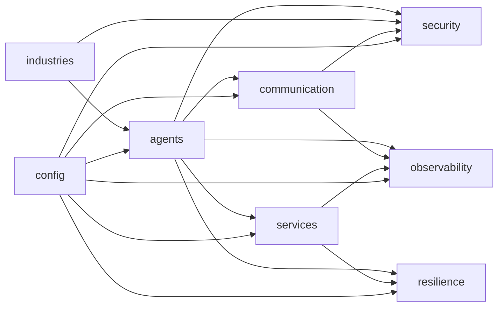

# HappyOS SDK Completion Design

## Overview

The HappyOS SDK completion involves transforming the current modular structure in `happyos/` into a production-ready, enterprise-grade SDK that can replace the legacy `happyos_sdk/` and be distributed via PyPI and GitHub. The design focuses on clean architecture, comprehensive functionality, and seamless migration from the legacy SDK.

## Architecture

### High-Level Architecture

```mermaid
graph TB
    subgraph "HappyOS SDK (happyos/)"
        subgraph "Core Layer"
            A[BaseAgent] --> B[AgentConfig]
            A --> C[MCPServerManager]
        end
        
        subgraph "Communication Layer"
            D[MCPClient] --> E[MCPProtocol]
            F[A2AClient] --> G[Transport Layer]
        end
        
        subgraph "Enterprise Layer"
            H[Security Module] --> I[TenantIsolation]
            H --> J[MessageSigner]
            K[Observability] --> L[Logging]
            K --> M[Metrics]
            K --> N[Tracing]
            O[Resilience] --> P[CircuitBreaker]
            O --> Q[RetryStrategy]
        end
        
        subgraph "Service Layer"
            R[UnifiedServiceFacades] --> S[DatabaseFacade]
            R --> T[StorageFacade]
            R --> U[ComputeFacade]
        end
        
        subgraph "Industry Layer"
            V[Finance Templates] --> W[ComplianceAgent]
            X[Healthcare Templates] --> Y[PatientDataAgent]
            Z[Manufacturing Templates] --> AA[ERPAgent]
        end
    end
    
    subgraph "External Systems"
        BB[AWS Services]
        CC[Database Systems]
        DD[Message Queues]
        EE[Monitoring Systems]
    end
    
    R --> BB
    R --> CC
    D --> DD
    K --> EE
```



### Module Dependencies



## Components and Interfaces

### 1. Core Agent Framework (`happyos/agents/`)

#### BaseAgent Class
```python
class BaseAgent(ABC):
    """Enterprise-grade base agent with full lifecycle management."""
    
    def __init__(self, config: AgentConfig, sdk_config: SDKConfig)
    async def start(self) -> None
    async def stop(self) -> None
    async def process_message(self, message: Dict[str, Any]) -> Dict[str, Any]
    async def get_status(self) -> Dict[str, Any]
    async def health_check(self) -> Dict[str, Any]
    
    # Abstract methods for subclasses
    @abstractmethod
    async def _initialize(self) -> None
    @abstractmethod
    async def _cleanup(self) -> None
    @abstractmethod
    async def handle_unknown_message(self, message: Dict[str, Any]) -> Dict[str, Any]
```

#### MCPServerManager
```python
class MCPServerManager:
    """Manages MCP server lifecycle and tool registration."""
    
    def __init__(self, agent_name: str, version: str)
    async def start_server(self) -> None
    async def stop_server(self) -> None
    async def register_tool(self, tool: MCPTool, handler: Callable) -> None
    async def unregister_tool(self, tool_name: str) -> None
```

### 2. Communication Layer (`happyos/communication/`)

#### MCP Protocol Implementation
```python
class MCPClient:
    """MCP protocol client for agent-to-agent communication."""
    
    def __init__(self, agent_name: str, agent_type: AgentType)
    async def initialize(self) -> None
    async def call_tool(self, target_agent: str, tool_name: str, 
                       arguments: Dict, headers: MCPHeaders) -> MCPResponse
    async def send_callback(self, reply_to: str, result: Dict, 
                           headers: MCPHeaders) -> None
    async def register_tool(self, tool_definition: MCPTool, 
                           handler: Callable) -> None
```

#### A2A Client for Backend Services
```python
class A2AClient:
    """A2A client for backend service communication."""
    
    def __init__(self, transport: A2ATransport)
    async def send_message(self, service: str, method: str, 
                          payload: Dict) -> Dict
    async def subscribe(self, topic: str, handler: Callable) -> None
    async def health_check(self) -> Dict[str, bool]
```

### 3. Security Module (`happyos/security/`)

#### Multi-Tenant Isolation
```python
class TenantIsolation:
    """Enterprise multi-tenant isolation with strict boundaries."""
    
    def __init__(self, config: SecurityConfig)
    async def validate_tenant_access(self, tenant_id: str, 
                                   resource: str, action: str) -> bool
    async def get_tenant_permissions(self, tenant_id: str) -> Dict[str, List[str]]
    async def audit_access_attempt(self, attempt: TenantAccessAttempt) -> None
```

#### Message Signing
```python
class MessageSigner:
    """Cryptographic message signing for secure communication."""
    
    def __init__(self, algorithm: SigningAlgorithm = SigningAlgorithm.ED25519)
    def sign_message(self, message: Dict, private_key: str) -> str
    def verify_signature(self, message: Dict, signature: str, 
                        public_key: str) -> bool
    def create_signed_headers(self, headers: MCPHeaders, 
                             private_key: str) -> MCPHeaders
```

### 4. Observability Module (`happyos/observability/`)

#### Structured Logging
```python
def get_logger(component: str, agent_type: str = None) -> UnifiedLogger:
    """Get structured logger with correlation support."""

class UnifiedLogger:
    """Enterprise logging with trace correlation."""
    
    def info(self, message: str, **kwargs) -> None
    def error(self, message: str, error: Exception = None, **kwargs) -> None
    def debug(self, message: str, **kwargs) -> None
    def with_context(self, **context) -> 'UnifiedLogger'
```

#### Metrics Collection
```python
class MetricsCollector:
    """Enterprise metrics collection with Prometheus integration."""
    
    def __init__(self, component: str)
    def increment(self, metric_name: str, labels: Dict = None) -> None
    def histogram(self, metric_name: str, value: float, labels: Dict = None) -> None
    def gauge(self, metric_name: str, value: float, labels: Dict = None) -> None
    async def get_summary(self) -> Dict[str, Any]
```

#### Distributed Tracing
```python
class TracingManager:
    """OpenTelemetry-compatible distributed tracing."""
    
    def __init__(self, service_name: str)
    def start_span(self, operation_name: str, parent_context: Any = None) -> Span
    def inject_context(self, headers: Dict) -> Dict
    def extract_context(self, headers: Dict) -> Any
```

### 5. Resilience Module (`happyos/resilience/`)

#### Circuit Breaker
```python
class CircuitBreaker:
    """Enterprise circuit breaker with configurable policies."""
    
    def __init__(self, config: CircuitBreakerConfig)
    async def call(self, func: Callable, *args, **kwargs) -> Any
    async def execute(self, operation: Callable) -> Any
    def get_state(self) -> CircuitState
    def get_statistics(self) -> Dict[str, Any]
```

#### Retry Strategy
```python
class RetryStrategy:
    """Configurable retry with exponential backoff."""
    
    def __init__(self, max_attempts: int = 3, backoff_type: str = "exponential")
    async def execute(self, operation: Callable, *args, **kwargs) -> Any
    def should_retry(self, exception: Exception, attempt: int) -> bool
```

### 6. Service Integration (`happyos/services/`)

#### Unified Service Facades
```python
class UnifiedServiceFacades:
    """Unified interface to all backend services."""
    
    def __init__(self, a2a_client: A2AClient)
    def database(self) -> DatabaseFacade
    def storage(self) -> StorageFacade
    def compute(self) -> ComputeFacade
    def search(self) -> SearchFacade
    def cache(self) -> CacheFacade
    def secrets(self) -> SecretsFacade
```

#### Database Facade
```python
class DatabaseFacade:
    """Database operations with automatic failover."""
    
    async def store_data(self, data: Dict, data_type: str) -> str
    async def query_data(self, query: Dict, limit: int = 100) -> List[Dict]
    async def update_data(self, data_id: str, updates: Dict) -> bool
    async def delete_data(self, data_id: str) -> bool
```

### 7. Industry Templates (`happyos/industries/`)

#### Finance Module
```python
class ComplianceAgent(BaseAgent):
    """FINRA/SEC compliant financial agent."""
    
    def __init__(self, compliance_standards: List[str], config: AgentConfig)
    async def check_compliance(self, transaction: Dict, 
                              standard: str) -> ComplianceResult
    async def generate_audit_report(self, period: str) -> Dict
    async def validate_trading_limits(self, order: Dict) -> bool
```

#### Healthcare Module
```python
class PatientDataAgent(BaseAgent):
    """HIPAA-compliant healthcare agent."""
    
    def __init__(self, encryption_level: str, config: AgentConfig)
    async def anonymize_phi(self, patient_data: Dict) -> Dict
    async def log_phi_access(self, patient_id: str, operation: str) -> None
    async def encrypt_sensitive_data(self, data: Dict) -> Dict
```

#### Manufacturing Module
```python
class ERPAgent(BaseAgent):
    """ERP integration agent for manufacturing."""
    
    def __init__(self, erp_systems: List[str], config: AgentConfig)
    async def sync_inventory(self, facility_id: str) -> Dict
    async def optimize_supply_chain(self, constraints: Dict) -> Dict
    async def update_erp_system(self, updates: Dict) -> bool
```

## Data Models

### Configuration Models
```python
@dataclass
class AgentConfig:
    agent_id: str
    agent_type: str
    tenant_id: Optional[str] = None
    enable_metrics: bool = True
    enable_tracing: bool = True
    enable_security: bool = True
    circuit_breaker_enabled: bool = True
    retry_enabled: bool = True
    log_level: str = "INFO"
    custom_config: Optional[Dict[str, Any]] = None

@dataclass
class MCPHeaders:
    tenant_id: str
    trace_id: str
    conversation_id: str
    reply_to: str
    auth_sig: str
    caller: str
    timestamp: Optional[str] = None
```

### Response Models
```python
@dataclass
class MCPResponse:
    status: str  # "ack", "success", "error"
    data: Optional[Dict[str, Any]] = None
    error: Optional[str] = None
    trace_id: Optional[str] = None

@dataclass
class ComplianceResult:
    compliant: bool
    violations: List[str]
    risk_score: float
    recommendations: List[str]
```

## Error Handling

### Exception Hierarchy
```python
class HappyOSSDKError(Exception):
    """Base exception for all SDK errors."""

class AgentError(HappyOSSDKError):
    """Agent-specific errors."""

class MCPError(HappyOSSDKError):
    """MCP protocol errors."""

class SecurityError(HappyOSSDKError):
    """Security and compliance errors."""

class ComplianceError(SecurityError):
    """Regulatory compliance violations."""

class ServiceUnavailableError(HappyOSSDKError):
    """Service unavailability errors."""
```

### Error Recovery Strategies
1. **Automatic Retry**: For transient failures with exponential backoff
2. **Circuit Breaker**: For service protection and failover
3. **Graceful Degradation**: Maintain core functionality during outages
4. **Error Correlation**: Link errors across distributed traces
5. **Compliance Reporting**: Automatic violation reporting for regulated industries

## Testing Strategy

### Unit Testing
- **Coverage Target**: Minimum 90% code coverage
- **Test Framework**: pytest with async support
- **Mocking**: Mock external services and dependencies
- **Fixtures**: Reusable test data and configurations

### Integration Testing
- **MCP Communication**: Test agent-to-agent communication flows
- **Service Integration**: Test service facade operations
- **Security Validation**: Test tenant isolation and compliance
- **Industry Templates**: Test compliance agent functionality

### Performance Testing
- **Agent Startup**: Measure initialization time
- **Message Throughput**: Test MCP message processing rates
- **Memory Usage**: Monitor resource consumption
- **Concurrent Operations**: Test under load

### Quality Assurance
- **Linting**: flake8, black, isort for code quality
- **Type Checking**: mypy for static type analysis
- **Security Scanning**: bandit for security vulnerabilities
- **Documentation**: Ensure all public APIs are documented

## Deployment and Distribution

### Package Structure
```
happyos/
├── setup.py                 # Package setup and metadata
├── pyproject.toml          # Modern Python packaging
├── requirements.txt        # Core dependencies
├── requirements-dev.txt    # Development dependencies
├── requirements-enterprise.txt  # Enterprise features
├── MANIFEST.in            # Package manifest
├── README.md              # Main documentation
├── LICENSE                # MIT license
├── CHANGELOG.md           # Version history
└── happyos/               # Source code
    ├── __init__.py
    ├── agents/
    ├── communication/
    ├── security/
    ├── observability/
    ├── resilience/
    ├── services/
    └── industries/
```

### PyPI Distribution
- **Package Name**: `happyos`
- **Version Strategy**: Semantic versioning (MAJOR.MINOR.PATCH)
- **Dependencies**: Minimal core, optional extras
- **Extras**: `[enterprise]`, `[industries]`, `[dev]`, `[all]`

### GitHub Repository
- **Repository**: `happyos/happyos-sdk`
- **License**: MIT (enterprise-friendly)
- **CI/CD**: GitHub Actions for testing and deployment
- **Documentation**: GitHub Pages with API docs
- **Issues**: Templates for bugs, features, and questions

## Migration Strategy

### Legacy SDK Compatibility
1. **Import Aliases**: Provide compatibility imports from legacy SDK
2. **API Mapping**: Map legacy API calls to new modular structure
3. **Deprecation Warnings**: Gradual deprecation of legacy imports
4. **Migration Tools**: Automated refactoring scripts

### Migration Steps
1. **Phase 1**: Complete new SDK implementation
2. **Phase 2**: Add compatibility layer for legacy imports
3. **Phase 3**: Update documentation and examples
4. **Phase 4**: Deprecate legacy SDK with migration timeline
5. **Phase 5**: Remove legacy SDK after migration period

This design provides a comprehensive blueprint for completing the HappyOS SDK with enterprise-grade features, clean architecture, and production-ready distribution capabilities.