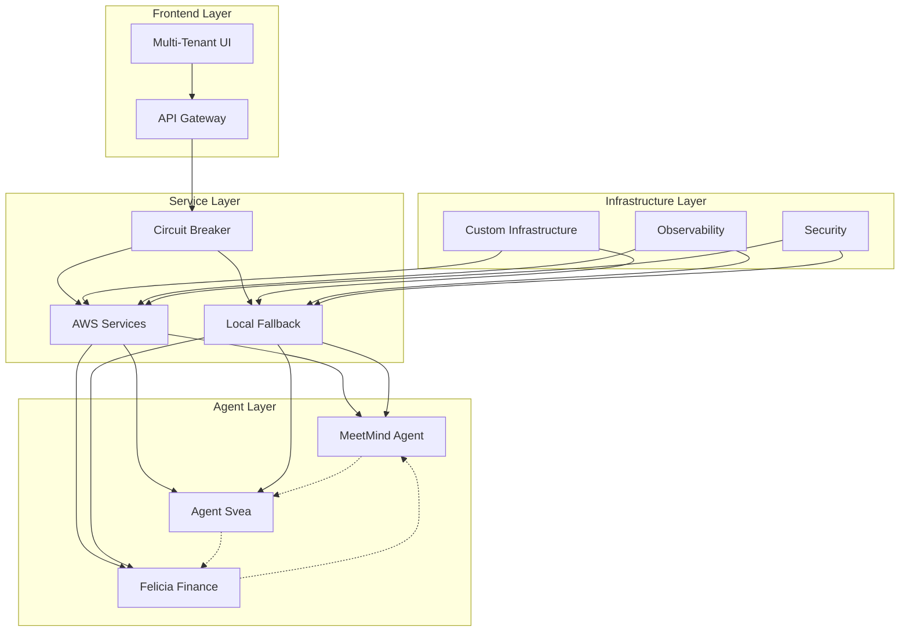
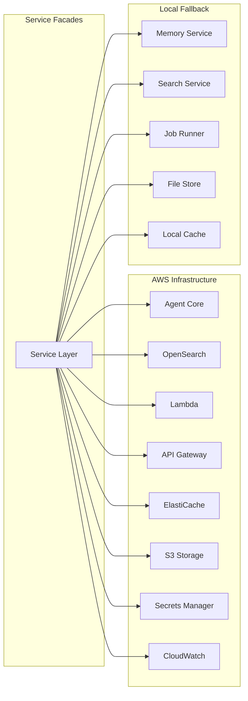

# Infrastructure Recovery Design

## Overview

This design document outlines the complete architecture for rebuilding the deleted backend infrastructure. The system implements a hybrid cloud-native and local fallback architecture with multi-tenant isolation, secure agent communication, and comprehensive observability.

## Architecture

### High-Level Architecture



### Component Architecture



## Components and Interfaces

### 1. AWS Infrastructure Layer

#### 1.1 Infrastructure as Code (IaC)
- **CDK Application**: `backend/infrastructure/aws/iac/app.py`
- **Stack Components**:
  - VPC Stack: Network isolation and security groups
  - OpenSearch Stack: Managed search with tenant indices
  - Lambda Stack: Serverless compute for agent runtime
  - API Gateway Stack: Request routing and throttling
  - ElastiCache Stack: Redis caching layer
  - CloudWatch Stack: Metrics and logging
  - KMS/Secrets Stack: Key management and secrets
  - IAM Stack: Role-based access control

#### 1.2 Service Adapters
- **Agent Core Adapter**: Memory management and agent runtime
- **OpenSearch Adapter**: Search operations with tenant isolation
- **Lambda Adapter**: Function invocation and lifecycle management
- **API Gateway Client**: Route management and throttling
- **S3 Adapter**: Object storage operations
- **ElastiCache Adapter**: Caching operations with TTL
- **EventBridge Client**: Event-driven communication
- **SQS Client**: Queue management and backpressure
- **Secrets Manager Adapter**: Secure configuration retrieval
- **STS/IAM Adapter**: Role delegation and permissions

### 2. Local Fallback Systems

#### 2.1 Core Services
- **Memory Service**: Local memory management (replaces Agent Core)
- **Search Service**: Local search with BM25/FAISS (replaces OpenSearch)
- **Job Runner**: Local task execution (replaces Lambda)
- **File Store Service**: Local file storage (replaces S3)

#### 2.2 Fallback Coordination
- **Circuit Breaker**: Monitors AWS service health and triggers fallback
- **Fallback Manager**: Coordinates transition between cloud and local
- **Recovery Engine**: Manages return to cloud services when available

### 3. Service Layer Architecture

#### 3.1 AWS Service Facades
```python
# Service interface pattern
class AgentCoreService:
    async def put_memory(self, user_id: str, key: str, value: Any) -> bool
    async def get_memory(self, user_id: str, key: str) -> Any
    async def create_session(self, tenant_id: str, config: dict) -> str

class OpenSearchService:
    async def index_document(self, doc: dict, tenant_id: str) -> str
    async def search(self, query: str, tenant_id: str, filters: dict = None) -> List[dict]
    async def hybrid_search(self, query: str, vector: List[float], tenant_id: str) -> List[dict]
```

#### 3.2 Service Implementation Strategy
- **Unified Interface**: Same interface for AWS and local implementations
- **Automatic Failover**: Circuit breaker pattern for seamless switching
- **Retry Policies**: Exponential backoff with jitter
- **Caching Strategy**: Multi-level caching (L1: memory, L2: Redis, L3: persistent)

### 4. Agent Communication (A2A Protocol)

#### 4.1 Message Structure
```python
class A2AMessage:
    message_id: str
    sender_agent: str
    recipient_agent: str
    tenant_id: str
    message_type: str
    payload: dict
    timestamp: datetime
    signature: str
    encryption_key_id: str
```

#### 4.2 Security Implementation
- **Encryption**: RSA-2048 for message encryption
- **Authentication**: Digital signatures for message integrity
- **Authorization**: Tenant-scoped permissions
- **Key Management**: Automatic key rotation and distribution

### 5. Multi-Tenant Architecture

#### 5.1 Tenant Isolation Strategy
- **Data Isolation**: Separate indices/tables per tenant
- **Compute Isolation**: Tenant-specific Lambda functions and containers
- **Network Isolation**: VPC and security group separation
- **Configuration Isolation**: Tenant-specific settings and policies

#### 5.2 Tenant Configuration
```yaml
# backend/config/tenants.yaml
tenants:
  meetmind:
    domain: "meetmind.se"
    agents: ["summarizer", "pipeline"]
    resources:
      opensearch_index: "meetmind-*"
      lambda_prefix: "meetmind-"
      cache_namespace: "mm:"
  
  agent_svea:
    domain: "agentsvea.se"
    agents: ["gov_docs", "workflow"]
    resources:
      opensearch_index: "agentsvea-*"
      lambda_prefix: "agentsvea-"
      cache_namespace: "as:"
  
  felicias_finance:
    domain: "feliciasfi.com"
    agents: ["ledger", "analytics"]
    resources:
      opensearch_index: "feliciasfi-*"
      lambda_prefix: "feliciasfi-"
      cache_namespace: "ff:"
```

## Data Models

### 1. Agent Session Model
```python
@dataclass
class AgentSession:
    session_id: str
    tenant_id: str
    agent_id: str
    user_id: str
    created_at: datetime
    last_activity: datetime
    status: SessionStatus
    memory_context: dict
    configuration: dict
```

### 2. A2A Message Model
```python
@dataclass
class A2AMessage:
    message_id: str
    conversation_id: str
    sender: AgentIdentity
    recipient: AgentIdentity
    message_type: MessageType
    payload: dict
    metadata: dict
    security: SecurityContext
    routing: RoutingInfo
```

### 3. Tenant Resource Model
```python
@dataclass
class TenantResource:
    tenant_id: str
    resource_type: ResourceType
    resource_id: str
    configuration: dict
    access_policy: dict
    created_at: datetime
    updated_at: datetime
```

## Error Handling

### 1. Circuit Breaker Pattern
```python
class CircuitBreaker:
    def __init__(self, failure_threshold: int = 5, timeout: int = 60):
        self.failure_threshold = failure_threshold
        self.timeout = timeout
        self.failure_count = 0
        self.last_failure_time = None
        self.state = CircuitState.CLOSED
    
    async def call(self, func, *args, **kwargs):
        if self.state == CircuitState.OPEN:
            if self._should_attempt_reset():
                self.state = CircuitState.HALF_OPEN
            else:
                raise CircuitBreakerOpenError()
        
        try:
            result = await func(*args, **kwargs)
            self._on_success()
            return result
        except Exception as e:
            self._on_failure()
            raise
```

### 2. Fallback Strategy
- **Graceful Degradation**: Reduce functionality rather than complete failure
- **Data Consistency**: Ensure eventual consistency between cloud and local
- **Recovery Coordination**: Smooth transition back to cloud services
- **User Communication**: Clear status indicators for service mode

## Testing Strategy

### 1. Unit Testing
- **Service Layer Tests**: Mock AWS services and test business logic
- **A2A Protocol Tests**: Message encryption, routing, and delivery
- **Circuit Breaker Tests**: Failure detection and recovery scenarios
- **Tenant Isolation Tests**: Verify no cross-tenant data leakage

### 2. Integration Testing
- **AWS Integration**: Test actual AWS service interactions
- **Fallback Integration**: Test cloud-to-local transitions
- **End-to-End Scenarios**: Complete user workflows across all layers
- **Performance Testing**: Load testing with multiple tenants

### 3. Demo Scenarios
- **Cloud Mode Demo**: Show full AWS functionality
- **Fallback Demo**: Simulate AWS failure and demonstrate local operation
- **Recovery Demo**: Show transition back to cloud services
- **Multi-Tenant Demo**: Demonstrate tenant isolation and security

### 4. Test Infrastructure
```python
# backend/tests/test_fallback_demo.py
class FallbackDemoTest:
    async def test_aws_to_local_fallback(self):
        # Start in AWS mode
        assert await health_service.check_aws_services() == True
        
        # Simulate AWS failure
        await self._simulate_aws_outage()
        
        # Verify fallback activation
        assert circuit_breaker.state == CircuitState.OPEN
        assert await agent_service.process_request(request) == expected_result
        
        # Restore AWS and verify recovery
        await self._restore_aws_services()
        assert circuit_breaker.state == CircuitState.CLOSED
```

## Performance Considerations

### 1. Caching Strategy
- **L1 Cache**: In-memory caching for frequently accessed data
- **L2 Cache**: Redis/ElastiCache for shared caching across instances
- **L3 Cache**: Persistent storage for long-term caching

### 2. Auto-Scaling
- **Lambda Concurrency**: Automatic scaling based on request volume
- **OpenSearch Scaling**: Dynamic node scaling based on search load
- **Cache Scaling**: ElastiCache cluster scaling for high availability

### 3. Cost Optimization
- **Resource Scheduling**: Scale down resources during low usage periods
- **Spot Instances**: Use spot instances for non-critical workloads
- **Reserved Capacity**: Reserve capacity for predictable workloads

## Security Considerations

### 1. Encryption
- **Data at Rest**: AES-256 encryption for all stored data
- **Data in Transit**: TLS 1.3 for all network communication
- **Message Encryption**: RSA-2048 for A2A message encryption

### 2. Access Control
- **IAM Policies**: Fine-grained permissions for AWS resources
- **RBAC**: Role-based access control for application features
- **Tenant Isolation**: Strict enforcement of tenant boundaries

### 3. Audit and Compliance
- **Audit Logging**: Comprehensive logging of all system activities
- **Compliance Monitoring**: Automated compliance checking
- **Security Scanning**: Regular vulnerability assessments