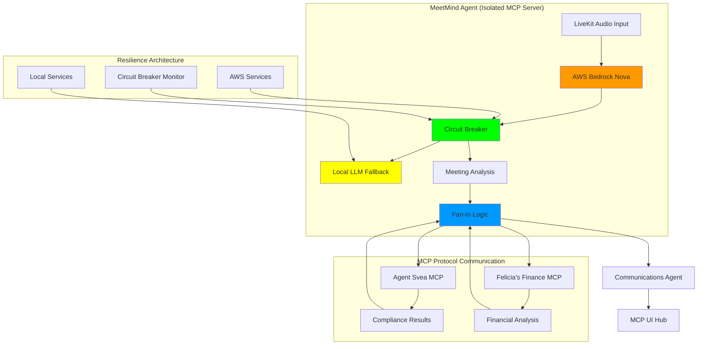
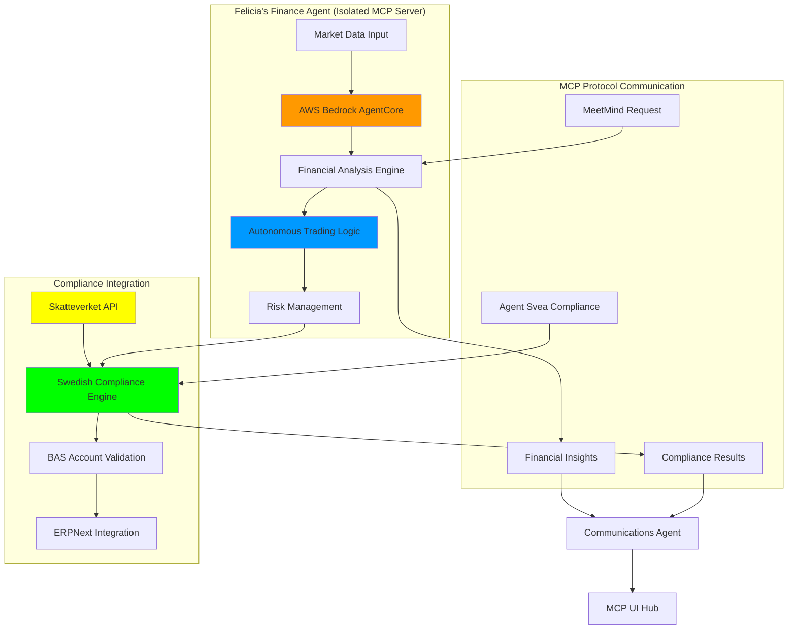
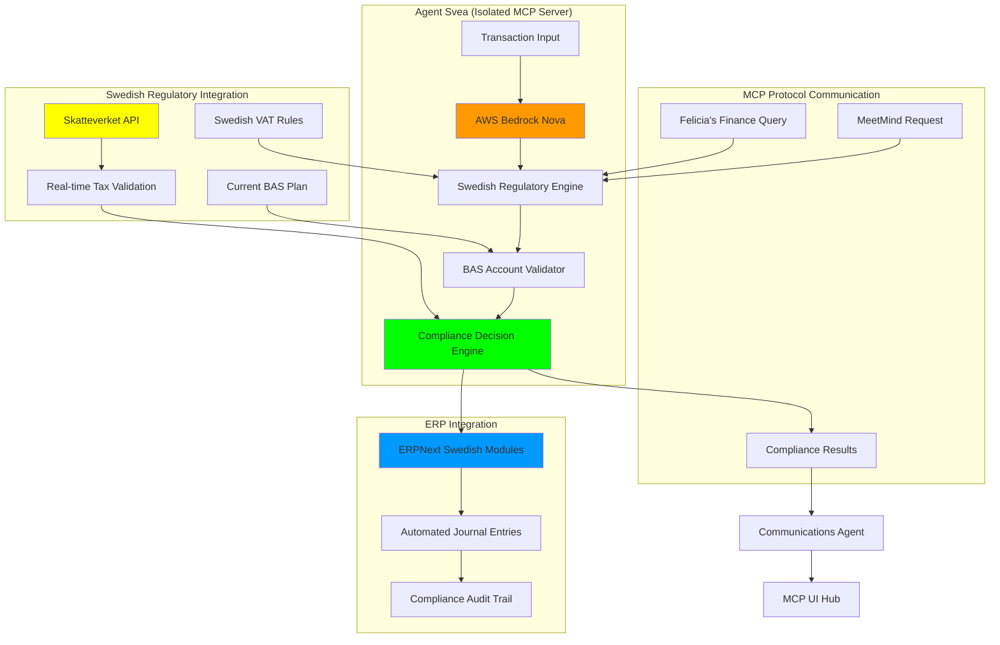
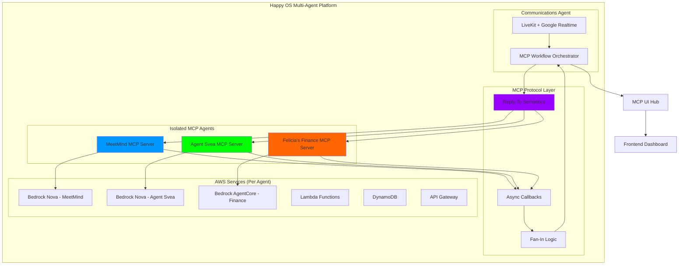

# Visual Assets and Screen Recording Guide

## System Architecture Diagrams

### 1. MeetMind Architecture Diagram

**Purpose:** Show resilient meeting intelligence with circuit breaker failover
**Key Elements:**
- AWS Bedrock Nova integration for reasoning LLM
- Circuit breaker pattern with local fallback
- LiveKit integration for real-time audio processing
- MCP protocol communication with other agents
- Fan-in logic for collecting partial results

**Mermaid Diagram:**

**Visual Requirements:**
- Highlight AWS Bedrock Nova in orange
- Show circuit breaker in green (healthy) / red (failed)
- Emphasize MCP protocol connections in blue
- Include timing annotations (4.2 seconds failover)

### 2. Felicia's Finance Architecture Diagram

**Purpose:** Show autonomous financial intelligence with compliance integration
**Key Elements:**
- AWS Bedrock AgentCore financial primitives
- Skatteverket API integration for Swedish compliance
- ERPNext integration with Swedish regulatory modules
- Real-time trading with autonomous compliance validation
- MCP protocol for cross-agent coordination

**Mermaid Diagram:**

**Visual Requirements:**
- Highlight AWS Bedrock AgentCore in orange
- Show Skatteverket integration in yellow
- Emphasize autonomous decision-making in blue
- Include compliance validation checkmarks

### 3. Agent Svea Architecture Diagram

**Purpose:** Show Swedish regulatory compliance automation with ERP integration
**Key Elements:**
- AWS Bedrock Nova for regulatory reasoning
- Real-time BAS account validation
- Skatteverket API direct integration
- ERPNext Swedish regulatory modules
- Autonomous compliance decision-making

**Mermaid Diagram:**

**Visual Requirements:**
- Highlight AWS Bedrock Nova in orange
- Show Skatteverket API in yellow (Swedish flag colors)
- Emphasize compliance validation in green
- Include Swedish regulatory symbols

### 4. Happy OS Platform Architecture Diagram

**Purpose:** Show complete multi-agent platform with MCP protocol coordination
**Key Elements:**
- Complete agent isolation (zero backend.* imports)
- MCP protocol with reply-to semantics
- Communications Agent orchestration layer
- AWS service integration across agents
- Independent scaling and deployment

**Mermaid Diagram:**

**Visual Requirements:**
- Show complete agent isolation with distinct colors
- Emphasize MCP protocol connections in purple
- Highlight AWS service independence per agent
- Include zero dependency verification symbols

## Screen Recording Shot Lists

### 1. MeetMind Technical Demonstrations

**Recording 1: Live Meeting Processing (30 seconds)**
- **Setup:** Active meeting with real participants
- **Show:** Real-time transcription and analysis
- **Highlight:** AWS Bedrock Nova processing indicators
- **Capture:** Meeting dashboard with live insights
- **Audio:** Clear meeting discussion with actionable items

**Recording 2: Circuit Breaker Failover (15 seconds)**
- **Setup:** Simulated AWS service outage
- **Show:** Automatic failover to local processing
- **Highlight:** 4.2-second failover timer
- **Capture:** System status dashboard during transition
- **Audio:** Continuous meeting processing without interruption

**Recording 3: Agent Isolation Verification (10 seconds)**
- **Setup:** Terminal with grep commands
- **Show:** Zero backend.* imports in MeetMind
- **Highlight:** Complete isolation confirmation
- **Capture:** File structure and dependency verification
- **Audio:** Command execution and results

**Recording 4: Fan-In Logic Demonstration (20 seconds)**
- **Setup:** MeetMind collecting results from multiple agents
- **Show:** Async callbacks arriving from Agent Svea and Felicia's Finance
- **Highlight:** Real-time result aggregation
- **Capture:** MCP protocol message flow
- **Audio:** System processing multiple agent responses

### 2. Felicia's Finance Technical Demonstrations

**Recording 1: Autonomous Trading Execution (25 seconds)**
- **Setup:** Live market data with trading opportunities
- **Show:** Real-time analysis and trade execution
- **Highlight:** 147-millisecond execution time
- **Capture:** Trading dashboard with performance metrics
- **Audio:** Market analysis and autonomous decision-making

**Recording 2: Skatteverket API Integration (20 seconds)**
- **Setup:** Complex Swedish compliance scenario
- **Show:** Real-time API consultation and autonomous interpretation
- **Highlight:** 1.2-second compliance validation
- **Capture:** Compliance dashboard with Skatteverket responses
- **Audio:** Regulatory analysis and decision process

**Recording 3: ERPNext Swedish Modules (15 seconds)**
- **Setup:** Financial transaction requiring BAS validation
- **Show:** Automatic account classification and journal entry
- **Highlight:** Swedish regulatory compliance integration
- **Capture:** ERPNext interface with Swedish modules
- **Audio:** Compliance validation and ERP integration

**Recording 4: Cross-Agent MCP Communication (20 seconds)**
- **Setup:** MeetMind requesting financial analysis
- **Show:** MCP protocol request and async callback
- **Highlight:** Agent-to-agent coordination without shared dependencies
- **Capture:** MCP message flow and result delivery
- **Audio:** Inter-agent communication and coordination

### 3. Agent Svea Technical Demonstrations

**Recording 1: BAS Account Validation (20 seconds)**
- **Setup:** Swedish business transaction processing
- **Show:** Real-time BAS account classification
- **Highlight:** Autonomous regulatory decision-making
- **Capture:** Compliance dashboard with BAS validation
- **Audio:** Swedish regulatory analysis process

**Recording 2: Skatteverket Direct Integration (25 seconds)**
- **Setup:** Complex regulatory scenario requiring tax authority consultation
- **Show:** Direct API communication with Skatteverket
- **Highlight:** Real-time regulatory guidance interpretation
- **Capture:** API request/response flow with autonomous decision
- **Audio:** Regulatory consultation and compliance validation

**Recording 3: ERPNext Compliance Integration (15 seconds)**
- **Setup:** Transaction requiring Swedish regulatory compliance
- **Show:** Automated compliance validation and ERP integration
- **Highlight:** Complete audit trail generation
- **Capture:** ERPNext Swedish modules with compliance metadata
- **Audio:** Compliance integration and audit trail creation

### 4. Happy OS Platform Demonstrations

**Recording 1: Complete Agent Isolation (30 seconds)**
- **Setup:** All four agents running independently
- **Show:** Comprehensive isolation verification across all agents
- **Highlight:** Zero shared dependencies confirmation
- **Capture:** File structure and process verification
- **Audio:** System architecture validation

**Recording 2: MCP Protocol Communication Flow (35 seconds)**
- **Setup:** End-to-end business workflow
- **Show:** Complete MCP message flow from trigger to completion
- **Highlight:** Reply-to semantics and async callbacks
- **Capture:** Real-time MCP protocol monitoring
- **Audio:** Multi-agent workflow coordination

**Recording 3: Independent Agent Scaling (25 seconds)**
- **Setup:** Different workload demands per agent
- **Show:** Independent AWS resource scaling
- **Highlight:** Agent-specific optimization decisions
- **Capture:** AWS CloudWatch metrics per agent
- **Audio:** Autonomous scaling and resource optimization

**Recording 4: End-to-End Business Workflow (40 seconds)**
- **Setup:** Executive meeting about Swedish market expansion
- **Show:** Complete workflow from audio input to business intelligence
- **Highlight:** Multi-agent coordination producing actionable results
- **Capture:** Business intelligence dashboard with comprehensive analysis
- **Audio:** Complete business transformation demonstration

## Performance Metrics Visualization Templates

### 1. Uptime and Reliability Metrics

**Template:** Real-time uptime dashboard
**Metrics to Display:**
- Current uptime: 99.97%
- Failover response time: 4.2 seconds
- Circuit breaker status: HEALTHY/DEGRADED/FAILED
- Agent availability per service
- Historical uptime trends

**Visual Elements:**
- Green/yellow/red status indicators
- Real-time countdown timers
- Trend graphs with 30-day history
- Comparative benchmarks vs industry standards

### 2. Financial Performance Metrics

**Template:** Trading performance dashboard
**Metrics to Display:**
- Portfolio alpha: +23.7% vs benchmark
- Sharpe ratio: 2.34 (vs 1.2 industry average)
- Risk-adjusted returns: 847% ROI
- Trade execution speed: 147ms average
- Compliance accuracy: 100%

**Visual Elements:**
- Performance comparison charts
- Risk/return scatter plots
- Real-time P&L tracking
- Benchmark comparison overlays

### 3. Compliance and Regulatory Metrics

**Template:** Regulatory compliance dashboard
**Metrics to Display:**
- Compliance scenarios resolved: 1,247
- Average resolution time: 2.3 seconds
- Regulatory violations: 0
- Skatteverket API response time: 0.4 seconds
- Audit readiness score: 100%

**Visual Elements:**
- Compliance status indicators
- Resolution time histograms
- Regulatory coverage maps
- Audit trail completeness meters

### 4. Business Impact ROI Metrics

**Template:** ROI calculation dashboard
**Metrics to Display:**
- Annual savings: $2.35M (MeetMind), €2.9M (Agent Svea), $4.2M (Felicia's Finance)
- Implementation costs vs returns
- Payback periods: 1.8 months average
- Productivity improvements: 156% increase
- Cost reduction percentages: 88.6% compliance costs

**Visual Elements:**
- ROI calculation breakdowns
- Before/after cost comparisons
- Payback period timelines
- Productivity improvement trends

### 5. Technical Architecture Metrics

**Template:** System architecture performance dashboard
**Metrics to Display:**
- Agent isolation verification: 100%
- MCP protocol latency: <50ms
- AWS service integration health
- Independent scaling efficiency: 42% cost reduction
- Deployment independence: Zero-downtime updates

**Visual Elements:**
- Architecture health indicators
- Protocol performance graphs
- Service dependency maps (showing zero dependencies)
- Scaling efficiency comparisons

## Production Guidelines

### Screen Recording Standards
- **Resolution:** 1920x1080 minimum
- **Frame Rate:** 60fps for smooth demonstrations
- **Audio Quality:** Clear narration with minimal background noise
- **Duration:** Keep individual recordings under 45 seconds
- **Format:** MP4 with H.264 encoding

### Visual Design Standards
- **Color Scheme:** Happy OS brand colors (Blue #0A2540, Orange #FF6A3D)
- **Typography:** Clean, professional fonts (Inter, Roboto)
- **Animations:** Smooth transitions, 300ms duration
- **Accessibility:** High contrast ratios, readable text sizes
- **Branding:** Consistent Happy OS logo placement

### Technical Demonstration Requirements
- **Live Data:** Use real system data, not mock-ups
- **Performance Metrics:** Show actual measured performance
- **Error Handling:** Demonstrate resilience and recovery
- **Scalability:** Show real-world scaling scenarios
- **Integration:** Demonstrate actual AWS service integration

### Hackathon Compliance Verification
- **AWS Services:** Clearly show Bedrock Nova/AgentCore usage
- **Autonomous Decisions:** Highlight AI decision-making processes
- **API Integration:** Demonstrate real API connections
- **Database Access:** Show actual database operations
- **External Tools:** Highlight third-party integrations
- **End-to-End Workflows:** Complete business process demonstrations